# Ansible Dynamic Assignments and Community Roles

In this project, you will explore dynamic assignments using the `include` module and understand how it differs from static assignments that use the `import` module.

## Key Concepts

### Static Assignment (import)

- Uses the `import` module.
- All tasks are pre-processed when the playbook is parsed.
- Any changes made to the included files during execution will not be reflected.
- Reliable and recommended for most use cases because debugging is easier.

### Dynamic Assignment (include)

- Uses the `include` module.
- Tasks are processed during execution, not during parsing.
- Any changes made to the included files during execution will be considered.
- Useful for environment-specific variables but harder to debug due to its dynamic nature.

## Summary

- **`import` = Static**: Tasks are pre-processed when playbooks are parsed. Changes after parsing are not considered.
- **`include` = Dynamic**: Tasks are processed during execution, and changes during execution are considered.

## Best Practices

- Use static assignments for general playbooks (more reliable).
- Use dynamic assignments for specific cases like environment variables, where runtime changes might be needed.

## Setting Up Dynamic Assignments

### Step 1: Set Up Dynamic Assignments

1. **Create a New Branch**

   First, create a new branch in your GitHub repository and call it `dynamic-assignments`:

   ```
   git checkout -b dynamic-assignments
   ```

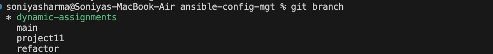
2. **Set Up Folder Structure**

- Create the dynamic-assignments folder
```
mkdir dynamic-assignments
```

- Inside the dynamic-assignments folder, create the env-vars.yml file
```
touch dynamic-assignments/env-vars.yml
```


- Create a folder for environment variables called env-vars
```
mkdir env-vars
```

- Inside env-vars, create files for each environment
```
touch env-vars/dev.yml
touch env-vars/stage.yml
touch env-vars/uat.yml
touch env-vars/prod.yml
```
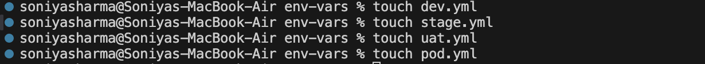
- Create the inventory structure with subfolders for each environment
```
mkdir -p inventory/dev
mkdir -p inventory/stage
mkdir -p inventory/uat
mkdir -p inventory/prod
```

- Create the playbooks and static-assignments folders if not already done
```
mkdir playbooks
mkdir static-assignments
```

3. **Add Content to env-vars.yml**

Next, add the following YAML content to env-vars.yml to dynamically include environment-specific variables:
yaml
```
---
- name: collate variables from env specific file, if it exists
  hosts: all
  tasks:
    - name: looping through list of available files
      include_vars: "{{ item }}"
      with_first_found:
        - files:
            - dev.yml
            - stage.yml
            - prod.yml
            - uat.yml
          paths:
            - "{{ playbook_dir }}/../env-vars"
      tags:
        - alwayys
```
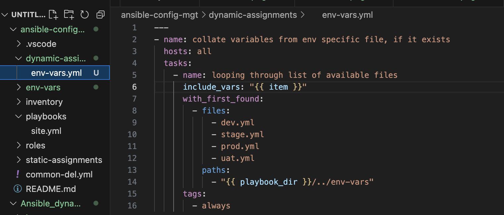

4. **Update the site.yml Playbook**

To include the env-vars.yml dynamically in your playbook, modify your site.yml file to reference it:
yaml
```
---
- hosts: all
  tasks:
    - include: ../dynamic-assignments/env-vars.yml
```

5. **Final Directory Structure**

Your repository should now have the following structure:

```
plaintext
├── dynamic-assignments
│   └── env-vars.yml
├── env-vars
│   ├── dev.yml
│   ├── stage.yml
│   ├── uat.yml
│   └── prod.yml
├── inventory
│   ├── dev
│   ├── stage
│   ├── uat
│   └── prod
├── playbooks
│   └── site.yml
└── static-assignments
    ├── common.yml
    └── webservers.yml
```
6. **Commit and Push Changes**

After setting up the structure and adding the files, commit and push your changes to the dynamic-assignments branch:
```
git add .
git commit -m "Set up dynamic assignments and environment variable files"
git push origin dynamic-assignments
```
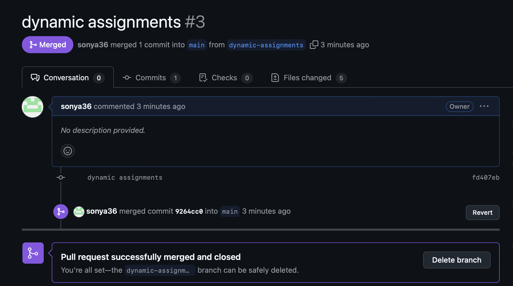
### Conclusion

You have successfully set up dynamic assignments in your Ansible repository! With these environment-specific variable files, your playbooks can dynamically include the appropriate configuration for each environment.
plaintext

Here’s how you can update your `site.yml`, create the MySQL role using a community role from Ansible Galaxy, and set up your GitHub for version control, as detailed in your instructions.

### Step 2: Update `site.yml` with Dynamic Assignments
Update your `site.yml` file to include dynamic assignments and import the necessary playbooks:

```yaml
---
- hosts: all
  name: Include dynamic variables
  become: yes
  tasks:
    - include_tasks: ../dynamic-assignments/env-vars.yml
      tags:
        - always

- import_playbook: ../static-assignments/common.yml

- import_playbook: ../static-assignments/uat-webservers.yml
```
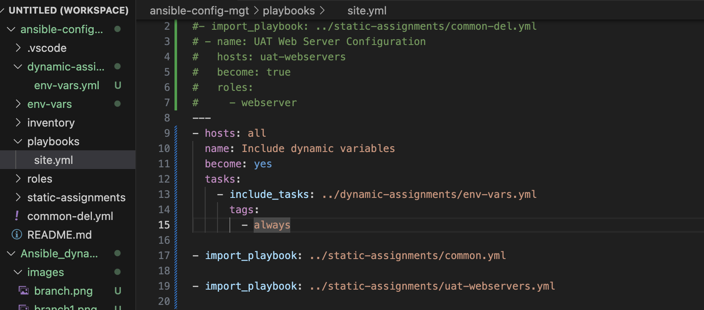
### Step 3: Install MySQL Community Role from Ansible Galaxy
To install a pre-built MySQL role developed by `geerlingguy`, follow these steps:

1. **Navigate to your Jenkins-Ansible server** (or your local machine with Ansible installed).
2. Verify that `git` is installed:
   ```bash
   git --version
   ```
3. Go to your `ansible-config-mgt` directory and run the following Git commands:

   ```bash
   git init
   git pull https://github.com/<your-name>/ansible-config-mgt.git
   git remote add origin https://github.com/<your-name>/ansible-config-mgt.git
   git branch roles-feature
   git switch roles-feature
   ```
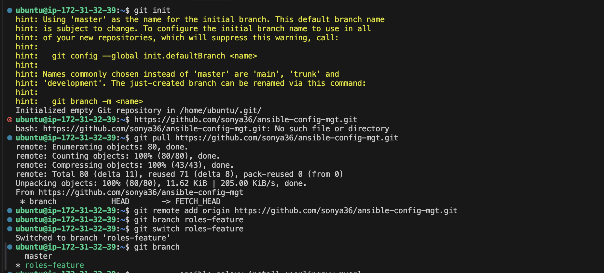
4. Inside the `roles` directory, install the MySQL role from Ansible Galaxy:

   ```bash
   ansible-galaxy install geerlingguy.mysql
   ```
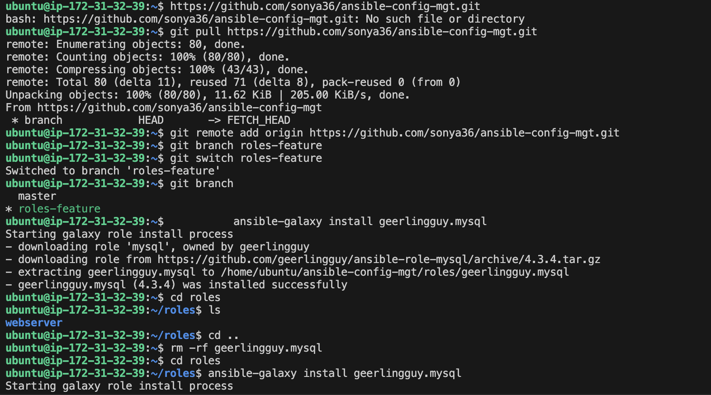
5. Rename the downloaded role folder from `geerlingguy.mysql/` to `mysql`:

   ```bash
   mv geerlingguy.mysql/ mysql
   ```
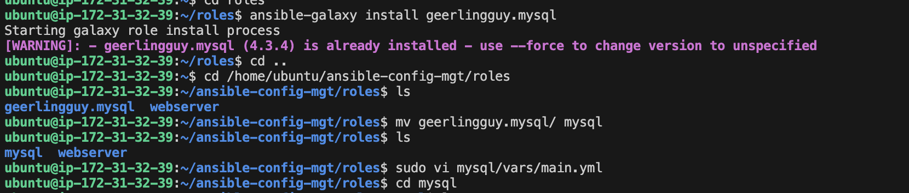

### Step 4: Configure the MySQL Role
1. Open the `roles/mysql/vars/main.yml` file and configure the MySQL role with the following settings:

```yaml
mysql_root_password: ""
mysql_databases:
  - name: tooling
    encoding: utf8
    collation: utf8_general_ci
mysql_users:
  - name: webaccess
    host: "<Webserver subnet cidr>"
    password: Admin123
    priv: "tooling.*:ALL"
```

Make sure to replace `<Webserver subnet cidr>` with your actual webserver subnet CIDR (e.g., `172.31.0.0/20`).
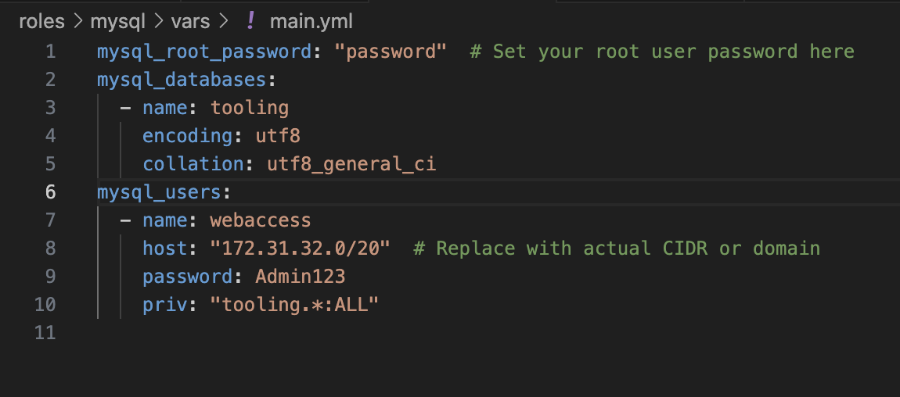
### Step 5: Create `db-servers.yml` Playbook
Inside the `static-assignments` folder, create a playbook named `db-servers.yml` to include the MySQL role:

```yaml
- hosts: db_servers
  become: yes
  vars_files:
    - vars/main.yml
  roles:
    - { role: mysql }
```
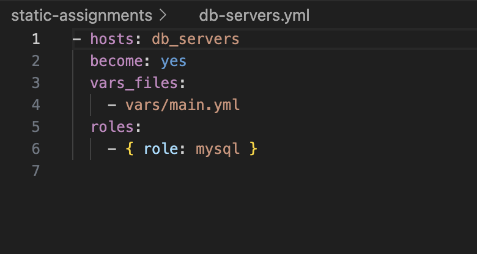
### Step 6: Push Changes to GitHub
After updating the role and playbook, you need to commit the changes to your GitHub repository.

1. Stage all the changes:

   ```bash
   git add .
   ```

2. Commit the changes with an appropriate commit message:

   ```bash
   git commit -m "Commit new role files into GitHub"
   ```

3. Push the changes to the `roles-feature` branch:

   ```bash
   git push --set-upstream origin roles-feature
   ```

### Step 7: Create a Pull Request and Merge to Main Branch
Once you're satisfied with your changes:

1. Navigate to your GitHub repository.
2. Create a pull request from `roles-feature` to `main`.
3. Review the changes and merge the pull request.

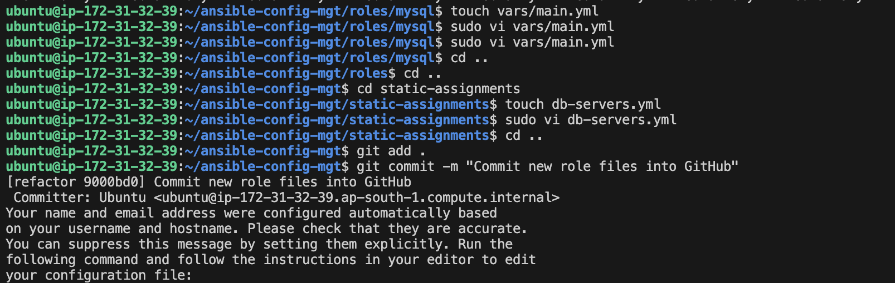
This completes the setup of dynamic assignments, MySQL role configuration, and GitHub workflow for your Ansible project.

- Create roles for Apache and NGINX as load balancers in your Ansible project, following the same method used for the MySQL role, and add a conditional logic to activate either of the two load balancers dynamically.

### Step 8: Download and Install Apache and NGINX Roles
1. **Install Apache Role:**

   Use Ansible Galaxy to install the Apache role:

   ```bash
   ansible-galaxy role install geerlingguy.apache
   ```

   Rename the folder from `geerlingguy.apache` to `apache`:

   ```bash
   mv geerlingguy.apache/ apache
   ```

2. **Install NGINX Role:**

   Use Ansible Galaxy to install the NGINX role:

   ```bash
   ansible-galaxy role install geerlingguy.nginx
   ```

   Rename the folder from `geerlingguy.nginx` to `nginx`:

   ```bash
   mv geerlingguy.nginx/ nginx
   ```
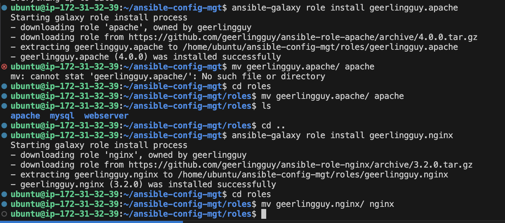

### Step 9: Configure Variables for Apache and NGINX Roles

1. **Apache Role:**
   Inside the `roles/apache/defaults/main.yml` file, declare a variable to enable or disable the Apache load balancer:

   ```yaml
   enable_apache_lb: false
   ```

2. **NGINX Role:**
   Inside the `roles/nginx/defaults/main.yml` file, declare a variable to enable or disable the NGINX load balancer:

   ```yaml
   enable_nginx_lb: false
   ```

3. **General Load Balancer Variable:**
   In both `roles/apache/defaults/main.yml` and `roles/nginx/defaults/main.yml`, declare a variable that controls whether the load balancer is required:

   ```yaml
   load_balancer_is_required: false
   ```

### Step 10: Create `loadbalancers.yml` Playbook

In the `static-assignments` folder, create a new playbook named `loadbalancers.yml` that includes both the NGINX and Apache roles with conditional logic:

```yaml
---
- hosts: lb
  become: yes
  roles:
    - role: nginx
      when: enable_nginx_lb | bool and load_balancer_is_required | bool
    - role: apache
      when: enable_apache_lb | bool and load_balancer_is_required | bool
```
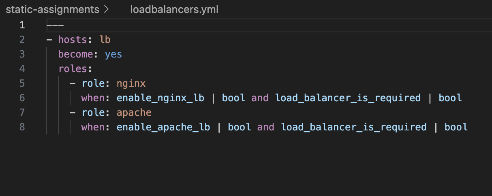
This logic ensures that only one of the load balancers is activated, depending on the environment variable settings.

### Step 11: Update `site.yml` to Include Load Balancer Playbook

Modify your `site.yml` to import the `loadbalancers.yml` playbook, as shown below:

```yaml
---
- hosts: all
  name: Include dynamic variables
  become: yes
  tasks:
    - include_tasks: ../dynamic-assignments/env-vars.yml
      tags:
        - always

- import_playbook: ../static-assignments/common.yml

- import_playbook: ../static-assignments/uat_webservers.yml

- import_playbook: ../static-assignments/loadbalancers.yml

- import_playbook: ../static-assignments/db-servers.yml
```
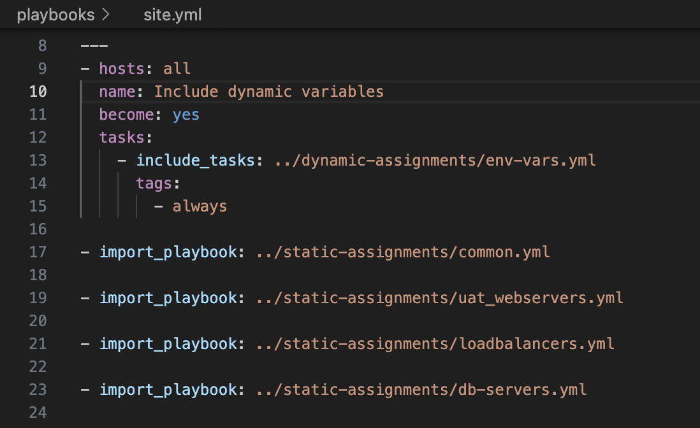
### Step 12: Activate Load Balancer in Environment Files

To enable the load balancer for a specific environment, update the respective environment's `env-vars` file.

For example, inside `env-vars/uat.yml`, set the following variables to enable the NGINX load balancer:

```yaml
---
load_balancer_is_required: true
enable_nginx_lb: true
enable_apache_lb: false
```

To switch to using the Apache load balancer instead, set the variables as:

```yaml
---
load_balancer_is_required: true
enable_nginx_lb: false
enable_apache_lb: true
```

This allows dynamic configuration of either Apache or NGINX as the load balancer, depending on the environment's needs.
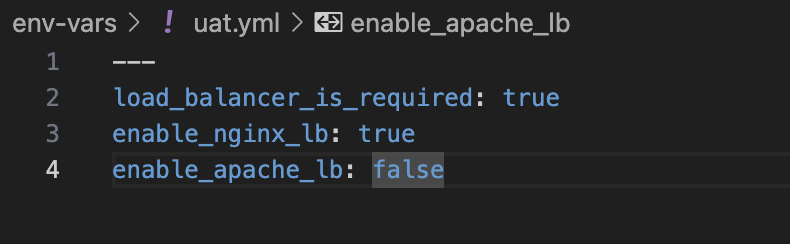

### Step 13: Push Changes to GitHub

Once you've configured everything, commit and push your changes:

1. Stage all the changes:

   ```bash
   git add .
   ```

2. Commit the changes:

   ```bash
   git commit -m "Added roles for Apache and NGINX load balancers"
   ```

3. Push the changes to your branch:

   ```bash
   git push --set-upstream origin roles-feature
   ```

### Step 14: Create Pull Request and Merge to Main

Create a pull request for your changes and merge them into the main branch once you are satisfied with the code.

This setup allows for flexible configuration of load balancers using NGINX or Apache, and ensures that the load balancer configuration is determined by environment-specific variables.


To configure Apache and Nginx as load balancers using Ansible roles, here's a detailed guide for each step.

### Step 15: Apache Load Balancer Configuration

1. **Check if Nginx is Running**:
    - In `roles/apache/tasks/main.yml`, add a task to check if Nginx is running and stop it if necessary.
    ```yaml
    - name: Check if nginx is running
      ansible.builtin.service_facts:

    - name: Stop and disable nginx if it is running
      ansible.builtin.service:
        name: nginx
        state: stopped
        enabled: no
      when: "'nginx' in services and services['nginx'].state == 'running'"
      become: yes
    ```

2. **Enable Apache Modules for Load Balancing**:
    - In `roles/apache/tasks/configure-debian.yml`, add tasks to enable required Apache modules.
    ```yaml
    - name: Enable Apache modules
      ansible.builtin.shell:
        cmd: "a2enmod {{ item }}"
      loop:
        - rewrite
        - proxy
        - proxy_balancer
        - proxy_http
        - headers
        - lbmethod_bytraffic
        - lbmethod_byrequests
      notify: restart apache
      become: yes
    ```

3. **Insert Load Balancer Configuration in Apache**:
    - Also in `configure-debian.yml`, insert the load balancer configuration into the virtual host file.
    ```yaml
    - name: Insert load balancer configuration into Apache virtual host
      ansible.builtin.blockinfile:
        path: /etc/apache2/sites-available/000-default.conf
        block: |
          <Proxy "balancer://mycluster">
            BalancerMember http://<webserver1-ip-address>:80
            BalancerMember http://<webserver2-ip-address>:80
            ProxySet lbmethod=byrequests
          </Proxy>
          ProxyPass "/" "balancer://mycluster/"
          ProxyPassReverse "/" "balancer://mycluster/"
        marker: "# {mark} ANSIBLE MANAGED BLOCK"
        insertbefore: "</VirtualHost>"
      notify: restart apache
      become: yes
    ```

4. **Enable Apache Load Balancer in Environment Variables**:
    - In `env-vars/uat.yml`, ensure Apache is enabled and Nginx is disabled:
    ```yaml
    load_balancer_is_required: true
    enable_nginx_lb: false
    enable_apache_lb: true
    ```

### Step 16: Nginx Load Balancer Configuration

1. **Check if Apache is Running**:
    - In `roles/nginx/tasks/main.yml`, add a task to stop Apache if it's running.
    ```yaml
    - name: Check if Apache is running
      ansible.builtin.service_facts:

    - name: Stop and disable Apache if it is running
      ansible.builtin.service:
        name: apache2
        state: stopped
        enabled: no
      when: "'apache2' in services and services['apache2'].state == 'running'"
      become: yes
    ```

2. **Update Nginx Handlers for sudo**:
    - In `roles/nginx/handlers/main.yml`, ensure `become: yes` is present for tasks requiring sudo.
    ```yaml
    - name: restart nginx
      ansible.builtin.service:
        name: nginx
        state: restarted
      become: yes
    ```

3. **Configure Nginx Virtual Hosts and Upstreams**:
    - In `roles/nginx/defaults/main.yml`, update `nginx_vhosts` and `nginx_upstreams`.
    ```yaml
    nginx_vhosts:
      - listen: "80"
        server_name: "example.com"
        root: "/var/www/html"
        index: "index.php index.html index.htm"
        locations:
          - path: "/"
            proxy_pass: "http://myapp1"

    nginx_upstreams:
      - name: myapp1
        strategy: "ip_hash"
        servers:
          - "<uat-server1-ip-address> weight=5"
          - "<uat-server2-ip-address> weight=5"
    ```

4. **Update Nginx Configuration Template**:
    - In `roles/nginx/templates/nginx.conf.j2`, create a server block template for Nginx configuration.
    ```jinja
    
    server {
        listen {{ vhost.listen }};
        server_name {{ vhost.server_name }};
        root {{ vhost.root }};
        index {{ vhost.index }};
        
        location {{ location.path }} {
            proxy_pass {{ location.proxy_pass }};
        }
        
    }
    
    ```

5. **Disable Default Vhost Include**:
    - Comment out the default Nginx vhost include line in `roles/nginx/templates/nginx.conf.j2`.
    ```jinja
    # include {{ nginx_vhost_path }}/*;
    ```

6. **Activate Nginx Load Balancer in Environment Variables**:
    - In `env-vars/uat.yml`, configure to enable Nginx and disable Apache:
    ```yaml
    load_balancer_is_required: true
    enable_nginx_lb: true
    enable_apache_lb: false
    ```

### Finalizing the Configuration

1. **Update Inventory for UAT**:
    - In `inventory/uat.yml`, define the web and load balancer servers.
    ```ini
    [uat-webservers]
    <server1-ipaddress> ansible_ssh_user=<ec2-username>
    <server2-ip address> ansible_ssh_user=<ec2-username>

    [lb]
    <lb-instance-ip> ansible_ssh_user=<ec2-username>

    [db-servers]
    <db-instance-ip> ansible_ssh_user=<ec2-username>
    ```
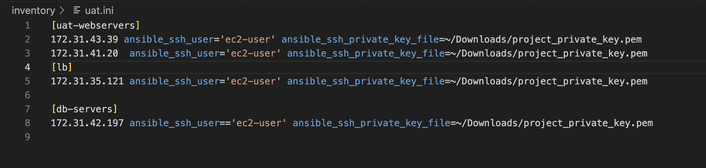
2. **Pull Request**:
    - Save your changes and create a pull request to merge the changes into the main branch of your GitHub repository.

With this setup, you can easily switch between Apache and Nginx load balancers dynamically based on the environment configurations.


Here's a breakdown of the configuration steps needed to set up your web server roles, install PHP and its dependencies, clone the tooling website from GitHub, and configure the database login functionality:

### Step 17: **Configure `roles/webserver/tasks/main.yml`**
This tasks file handles the installation of Apache, PHP, dependencies, and cloning the website from the repository. The specific tasks are:

```yaml
# tasks file for webserver
---
- name: Install Apache
  remote_user: ec2-user
  become: true
  become_user: root
  ansible.builtin.yum:
    name: "httpd"
    state: present

- name: Enable Apache
  remote_user: ec2-user
  become: true
  become_user: root
  ansible.builtin.command:
    cmd: sudo systemctl enable httpd

- name: Install EPEL release
  remote_user: ec2-user
  become: true
  become_user: root
  ansible.builtin.command:
    cmd: sudo dnf install https://dl.fedoraproject.org/pub/epel/epel-release-latest-9.noarch.rpm -y

- name: Install dnf-utils and Remi repository
  remote_user: ec2-user
  become: true
  become_user: root
  ansible.builtin.command:
    cmd: sudo dnf install dnf-utils http://rpms.remirepo.net/enterprise/remi-release-9.rpm -y

- name: Reset PHP module
  remote_user: ec2-user
  become: true
  become_user: root
  ansible.builtin.command:
    cmd: sudo dnf module reset php -y

- name: Enable PHP 8.2 module
  remote_user: ec2-user
  become: true
  become_user: root
  ansible.builtin.command:
    cmd: sudo dnf module enable php:remi-8.2 -y

- name: Install PHP and extensions
  remote_user: ec2-user
  become: true
  become_user: root
  ansible.builtin.yum:
    name:
      - php
      - php-opcache
      - php-gd
      - php-curl
      - php-mysqlnd
    state: present

- name: Install MySQL client
  remote_user: ec2-user
  become: true
  become_user: root
  ansible.builtin.yum:
    name: "mysql"
    state: present

- name: Start PHP-FPM service
  remote_user: ec2-user
  become: true
  become_user: root
  ansible.builtin.service:
    name: php-fpm
    state: started

- name: Enable PHP-FPM service
  remote_user: ec2-user
  become: true
  become_user: root
  ansible.builtin.service:
    name: php-fpm
    enabled: true

- name: Set SELinux policies for web servers
  remote_user: ec2-user
  become: true
  become_user: root
  ansible.builtin.command:
    cmd: sudo setsebool -P httpd_execmem 1
    cmd: sudo setsebool -P httpd_can_network_connect=1
    cmd: sudo setsebool -P httpd_can_network_connect_db=1

- name: Install Git
  remote_user: ec2-user
  become: true
  become_user: root
  ansible.builtin.yum:
    name: "git"
    state: present

- name: Clone the tooling website repo
  remote_user: ec2-user
  become: true
  become_user: root
  ansible.builtin.git:
    repo: https://github.com/mimi-netizen/tooling.git
    dest: /var/www/html
    force: yes

- name: Copy HTML content to one level up
  remote_user: ec2-user
  become: true
  become_user: root
  command: cp -r /var/www/html/html/ /var/www/

- name: Start Apache service
  remote_user: ec2-user
  become: true
  become_user: root
  ansible.builtin.service:
    name: httpd
    state: started

- name: Recursively remove /var/www/html/html/ directory
  remote_user: ec2-user
  become: true
  become_user: root
  ansible.builtin.file:
    path: /var/www/html/html
    state: absent
```


### Step 18: **Update the `functions.php` File**
You will need to log in to your UAT web server, modify the `functions.php` file, and insert the database credentials specified in your MySQL roles.

Steps:
- Log into the UAT web server:

  ```bash
  ssh ec2-user@<uat-webserver-ip>
  ```

- Navigate to the `/var/www/html` directory and open `functions.php` in an editor:

  ```bash
  sudo vi /var/www/html/functions.php
  ```

- Update the database connection details:

  ```php
  $dbhost = '<mysql-db-server-private-ip>';
  $dbuser = 'admin';
  $dbpass = 'admin';
  $dbname = 'tooling';
  ```

- Save and exit the file.

### Step 19 : **Import the Database**
You can import the `tooling-db.sql` file into your MySQL database using the following steps:

- Log in to the MySQL server:

  ```bash
  mysql -u admin -p
  ```

- Create the tooling database:

  ```sql
  CREATE DATABASE tooling;
  ```

- Import the `tooling-db.sql` file:

  ```bash
  mysql -u admin -p tooling < /path/to/tooling-db.sql
  ```

### 4. **Create a User in the Tooling Database**
- Log in to MySQL:

  ```bash
  mysql -u admin -p
  ```

- Create the `myuser`:

  ```sql
  CREATE USER 'myuser'@'%' IDENTIFIED BY 'password';
  GRANT ALL PRIVILEGES ON tooling.* TO 'myuser'@'%';
  FLUSH PRIVILEGES;
  ```

### Step 20: **Run the Playbook**
Run the playbook against the UAT inventory to set up your web servers and ensure the load balancer is properly configured.

```bash
ansible-playbook -i inventory/uat.yml playbooks/site.yml
```
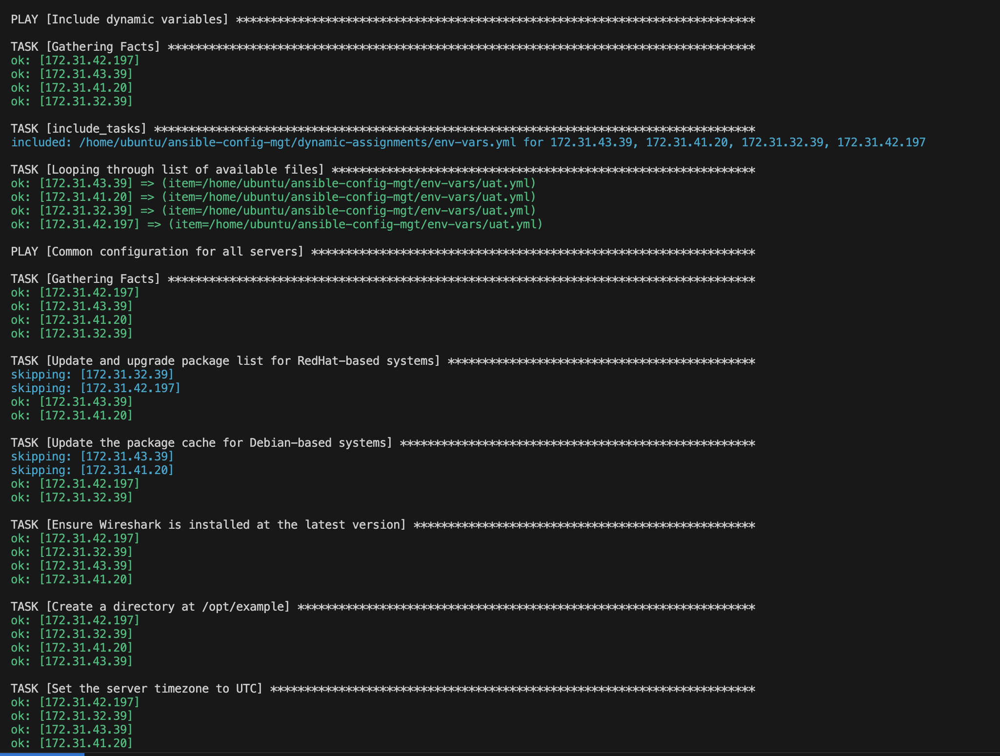
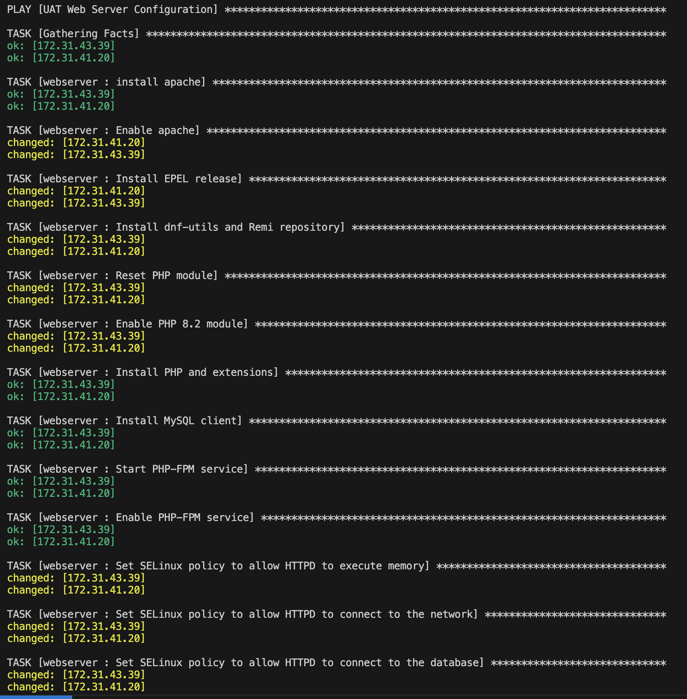
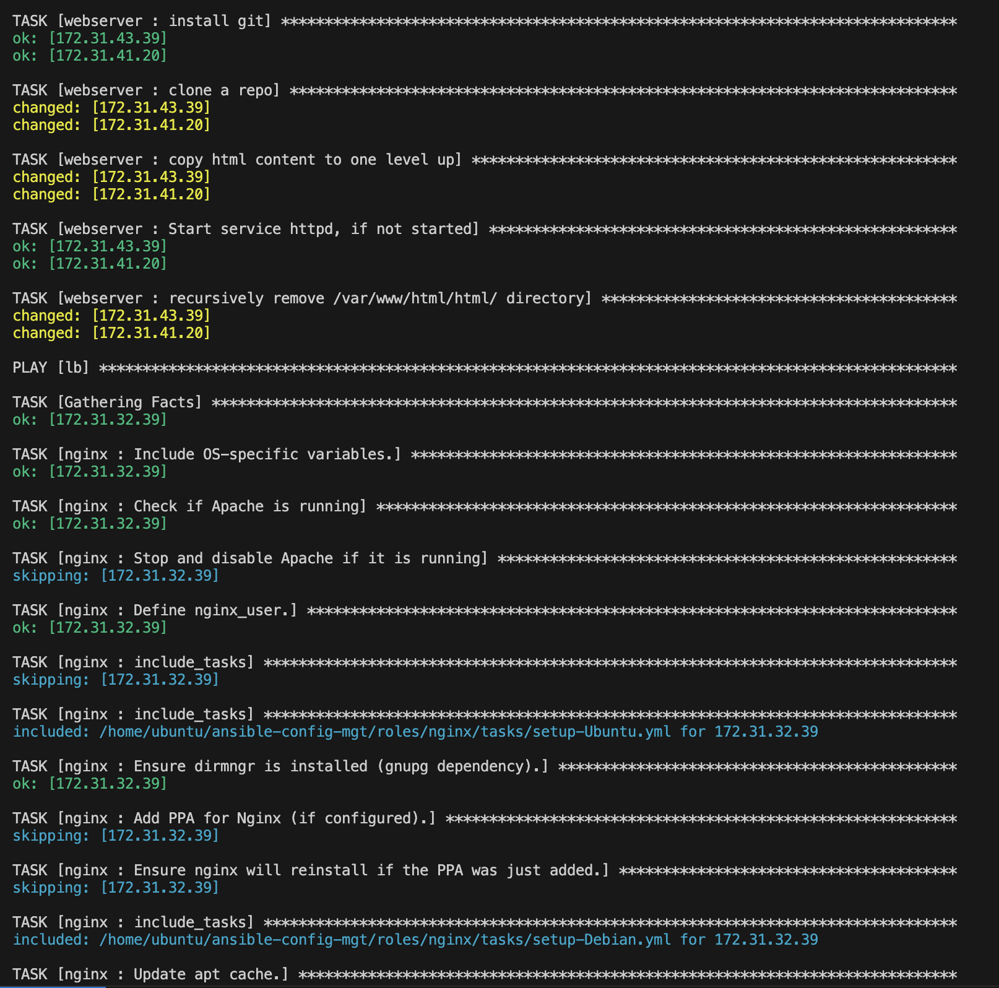
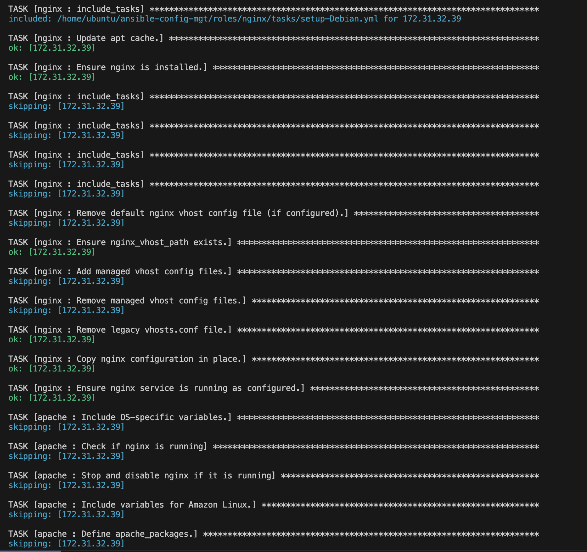
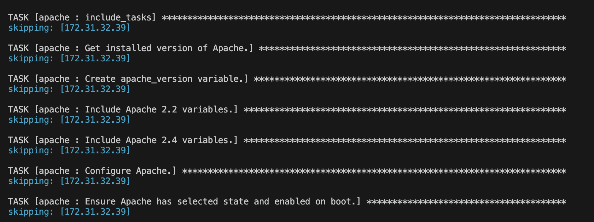
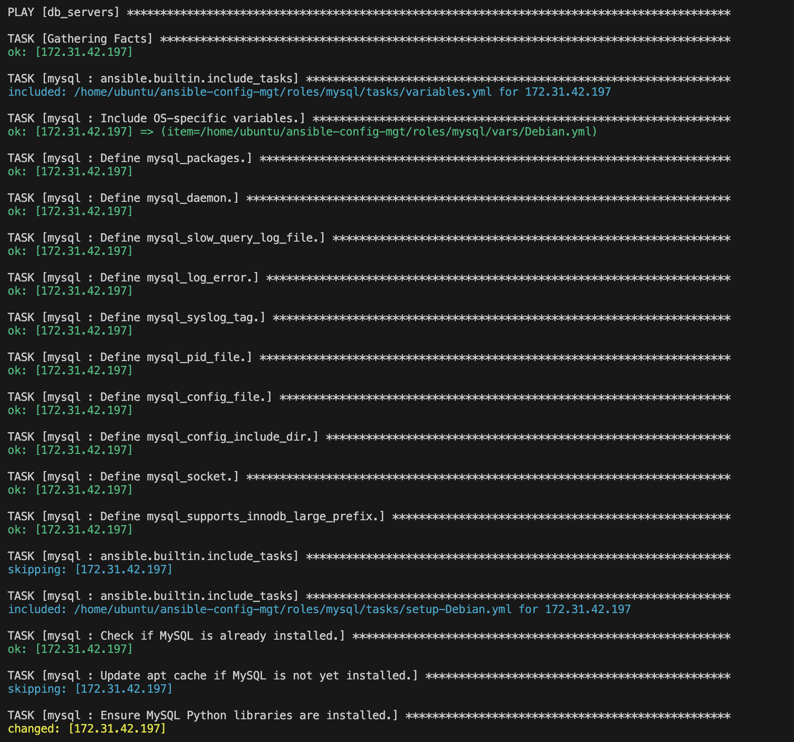
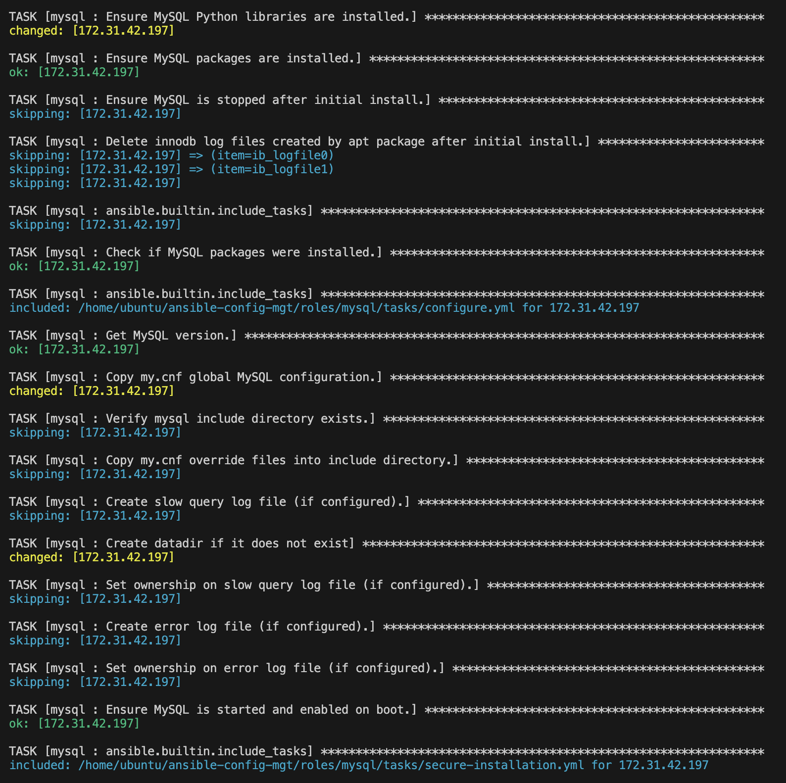
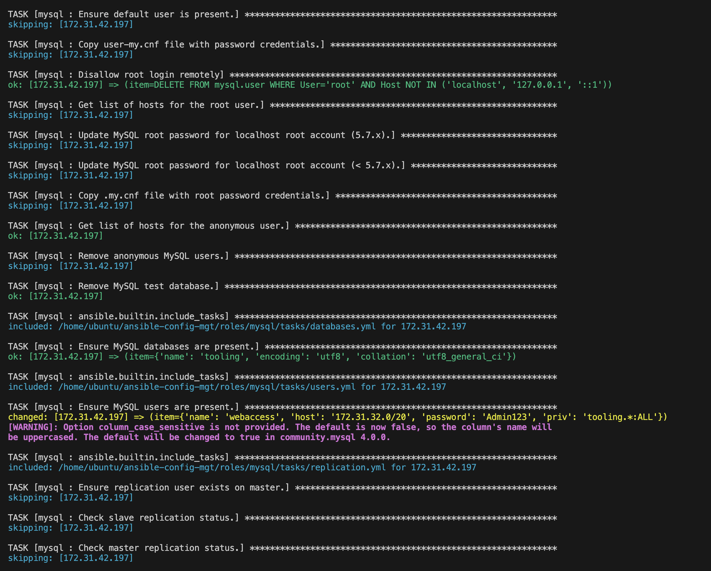
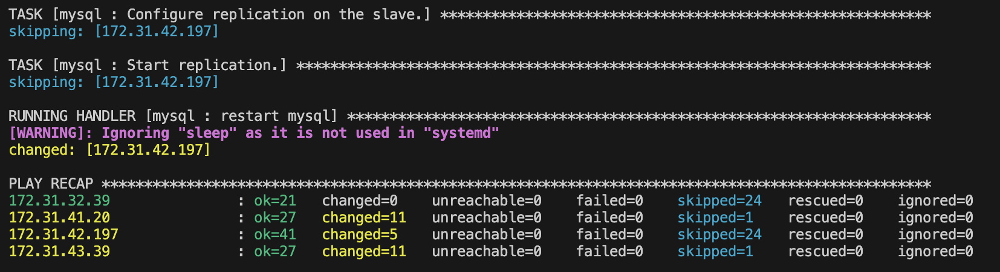

After completing these steps, visit your UAT server's IP address or load balancer to confirm everything is working and that you can log in with the credentials you set up.

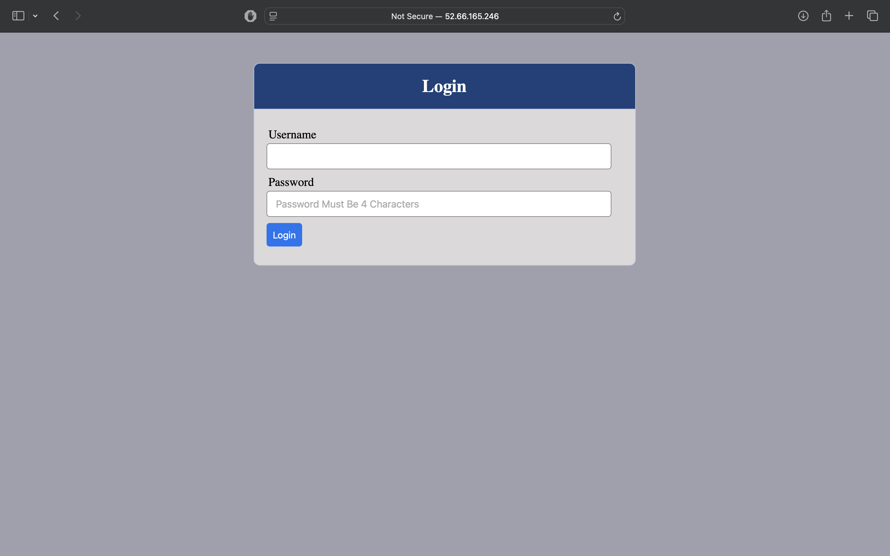
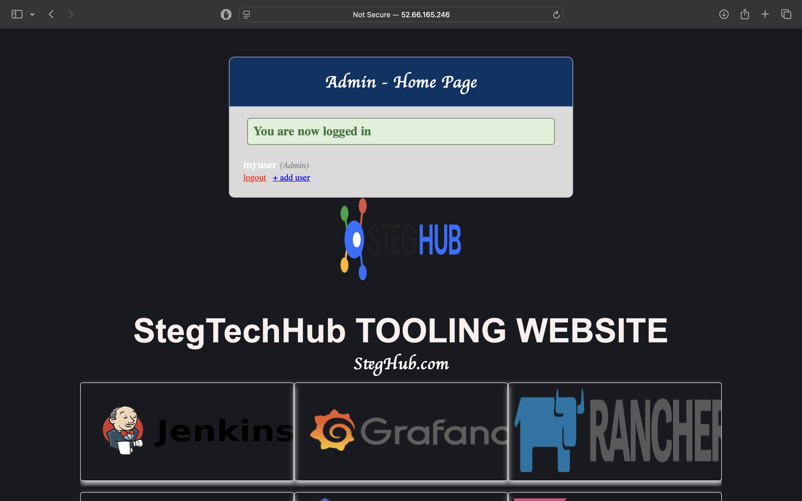
